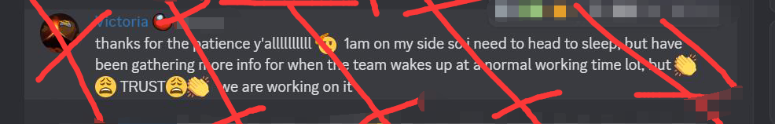

Q&A Repository. Look at Discussions.

# Match Ducking
Match duckers duck the duck game with match ducking to force their duck developers fix the ducks in their duck game.

## What is Match Ducking
"Ducking", referring to "Hacking" specifically, is an attempt to use exploits in the Among Us game server to kick, ban or overload lag players and make the game unplayable, forcing players to spam report the hacking raids and exploits to InnerSloth team, thus forcing the game devs to fix the exploits and make a better Among Us playground.

What makes it different from other script kids and cheat menu kids is that we do it with better automatization program coded by our duck devs, which is able to make above 1k connections per instance. Also our initial goal is to force InnerSloth to fix exploits reported to them months ago instead of simply ruining games for fun.

## Why do you duck?
The initial goal of ducking is to force InnerSloth devs to fix exploits in their game. Those exploits have been reported mutliple times to them through different means and existed at least for months and obviously they choose to answer developers and exploiters with a general bot response and do their slothy work to create new cosmetics and make duck money.

By ducking, we make use of the power of the large player base of Among Us game, forcing players to spam report cheating/hacking raids to their sleepy bots support team, thus forcing real human devs to engage in and fix the exploits we use.
> Innersloth devs only jump in when there is a huge hacking raids active around. And they won't react when they are on their sweat summer or winter hoilday. We are convinced that we can't make the exploits patched by the lazy sloth team in normal means, so we definately choose to duck to make the issue worse.

We are sorry for choosing this extreme way to make the exploits patched. But at least they are patched. We actually limited ourselves to not do attempts that are too bad and agreesive (since basically you can spam and post anything with the bots and modify their names to whatever you want). 

Also a fact it's that we only do serious duck at the very beginning (like lagging and banning everyone, making the games unplayable), till we convinced that InnerSloth has known the issue and are making necessary patches. Then we will be less aggressive (like only join games but don't crash players, only duck around to clarify our existence and put urgency on Sloths) until the exploits we used are completely patched.
> In the April duck raids, you may think InnerSloth has made effective patches in less than 24 hours that make most of the kick bots disappeared. That's not the case. We learned the dating rooms issues from DuckoMenu's Discord (in case you don't know, it's sweaty rooms hosted by sweats who are pedophilia, racist sexless or similiar stuffs, in an attempt to satisfy their special cravings. These rooms often come with 4-6 max players, 1 impostor and skeld map in matchmaking list), and we are convinced that InnerSloth won't take proper actions regarding it. So we stopped our kick bots and coded new duck hoster, which host fake games that looks like dating rooms (4-6 max players and 1 impostor or so). In this mean we address the issue in a less aggressive way, where normal players can continue playing the games while daters are likely cooked, though Innersloth finally chooses to ignore the dating room issue.

## What raid / duck attempts you are taking responsibility for?
We take responsibilities for the massive bot ban wave in January 2025 (MatchHacking project) and the vote ban kick wave & DuckDater fake rooms since April 2025.

All the other raid attempts (for example, eariler lobby murder player bots and Parasites Central spam bots) are not by us and we believe these attempts were made with fully malicious intentions.

## How do you prove that you are the ducks that do above duck attempts?
We attached part of the necessary source codes of our duck bots along with our repo, that we believe enough to prove our identity.
> Hope this won't help other script kids grow up into ducks like us.

## Credits
While we independently coded most of our ducking programs, we used exploits and techniques that weren't discovered or fully developed by us.

### Github Copilot
Copilot helped ease our coding pressure and make our ducker run in a very short time.

### SickoMenu
SickoMenu is a good project overall, though some of their developers do not seem to be skilled enough that they added plenty of shit codes to others' good codes.

1. Spaces in friendcodes to bypass matchmaking limits of guest accounts
2. ProtectPlayer and QuickChat and other related overloads exploits
3. Let us know the dating lobby issues

### MalumMenu
1. Referred to MalumMenu to generate massive guest accounts with friendcodes
2. Inspired us of the vote kick technique
> Vote kick is still not patched in latest anticheat

### EzHacked
As a matter of fact, cmd checkname and check color and all other cmd related ban exploit are initially used by EzHacked bot. SickoMenu skidded these exploits to their cheat menu and we skidded from them and used in Jan raids.
1. cmd related ban exploits

### Impostor
We use Impostor to test our ducks locally and referred their codes to build JoinGame and HostGame packets used in ducks.
1. Help test ducks locally
2. Code references for JoinGame and HostGame
3. FilterGames exploit (revealed by NikoCat233)
> In the #685 pr of Impostor, NikoCat233 revealed the filter game exploit that can be used to get rooms in all languages and all chat modes, which is much more efficient than querying every language.

### NikoCat233's Impostor Server
NikoCat233 and Pietro built a full http api to request mm tokens and do friendcodes related requests in their fork of Impostor. At the moment of writing this document they have made these branches private so we can't correctly credit them.

### among-us-protocol
https://github.com/roobscoob/among-us-protocol

Referred while coding some shits. It's outdated but it's still a good wiki for beginners.

### Reactor
For providing the game assembly that we can build most of our shit codes from it.

## Technique Details
Most of the techniques we used are refered in credits and should already be patched by InnerSloth. We can't share all the techniques we used as some of them are still too aggressive and we are in fear of it being used by people different from us.

## Our relationship with SickoMenu
Some people think SickoMenu devs are behind these duck raids. Actually not! We did used their techniques and exploits but we are not them. We post kellnotwirk messages as a joke regarding them, and immediately stopped doing so when some smart ass claims that SickoMenu is behind these attacks. We didn't expect people downloading cheats to combat ducks, sorry!

## InnerSloth moment
Sorry for joking about SuperSus. We didnt expect it could cause a drama strike.

> MatchDucking : Global Offensive\nPowered by SuperSus dot io

> innersloth please block friend codes from having spaces (thats used to bypass guest acc)

> MatchDuckingbywwwSuperSusio/en

> KellNotwirkbyworstcheatdsc*gg/sickos

> writer.Write($"{Utils.GenerateSecureRandomString(1)}nnersloth you need stronger moderation to stop d{Utils.GenerateSecureRandomDigits(1)}ting lobbies.");

> Good Night Victoria Support Team and Sloth Dev
>

## Our future
InnerSloth has done enough patches we requested (~~requested by ducking~~) and ducks are cooked by them. But we will definately be back again when there are new serious exploits and techniques found and revealed.